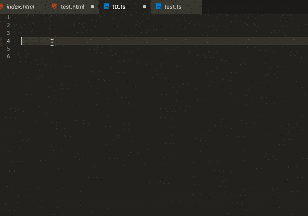

# Accelya UI SDK

## VS Code UI SDK snippets

---

This extension contains code snippets for UI SDK in HTML & Typescript/javascript syntax for [Vs Code][code] editor (supports both JavaScript and TypeScript).

---

---

## Installation

In order to install an extension you need to launch the Command Pallete (Ctrl + Shift + P or Cmd + Shift + P) and type Extensions.
There you have either the option to show the already installed snippets or install new ones. Search for _UISDK code snippets_ and install it.

## Supported languages (file extensions)

- JavaScript (.js)
- TypeScript (.ts)
- Html (.html)

## Snippets

Below is a list of all available snippets and the triggers of each one. The **⇥** means the `TAB` key.

### Import and export

|       Trigger | Content                  |
| ------------: | ------------------------ |
| `mcf:header→` | create `mcf header code` |

[code]: https://code.visualstudio.com/

# Changelog

All notable changes to this project will be documented below.

The format is based on [Keep a Changelog](https://keepachangelog.com/en/1.0.0/),
and this project adheres to [Semantic Versioning](https://semver.org/spec/v2.0.0.html).

## [0.0.3] - 18-10-2018

### Added

- Added new FAB component support.
- Change Accelya-header to mcf-header component.
